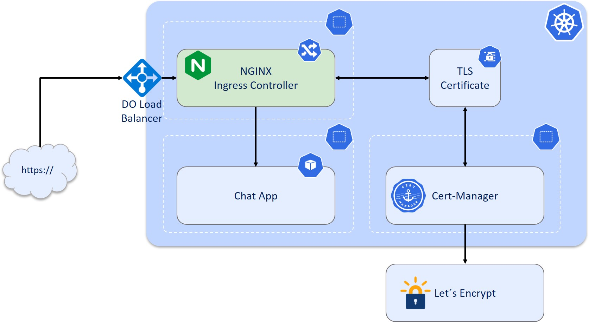

# cert-manager-demo

Das Ziel der Demo ist es unsere Chat-App über einen Webbrowser zugänglich zu machen und mittels TLS Terminierung abzusichern.
Dabei deployen wir unsere Chat-App in einem Kubernetes-Cluster, richten den von Kubernetes verwalteten Nginx-Ingress-Controller ein und erstellen eine Ingress-Ressource, 
um den Datenverkehr an unseren Chat-Dienst zu leiten. Sobald wir den Ingress eingerichtet haben, werden wir **cert-manager** in unserem Cluster installieren, 
um TLS-Zertifikate für die Verschlüsselung des HTTP-Verkehrs zum Ingress zu verwalten und bereitzustellen.



### Vorbedingungen
* Docker Image der Chat-App über Docker Hub zugänglich machen: [Pushing a Docker container image to Docker Hub](https://docs.docker.com/docker-hub/repos/#:~:text=To%20push%20an%20image%20to,docs%2Fbase%3Atesting%20)
* Installieren von kubectl: [Install kubectl](https://kubernetes.io/docs/tasks/tools/)
* Kubernetes Cluster: Ich verwende [DigitalOcean](https://www.digitalocean.com/products/kubernetes), andere Tools wie [kind](https://kind.sigs.k8s.io/docs/user/quick-start/) sind auch möglich
* Eigene Domain registrieren: Bspw. bei [Google Domains](https://domains.google/intl/de_de/) !!! ACHTUNG: Kostenpflichtig !!!

## 1. Deploy Chat-App
Zuallererst erstellen wir einen Namespace, in dem unsere Chat-App eingebettet ist.
```yaml
apiVersion: v1
kind: Namespace
metadata:
  name: chat
```
```
kubectl apply -f namespace.yaml
```

Wir definieren ein Deployment, das unseren Pod managed, in dem unser Chat-App Container läuft. Das Docker Hub image `nidigeser/chatapp:latest` wird verwendet.
Die Chat-App hört auf den Port 3000.
```yaml
apiVersion: apps/v1
kind: Deployment
metadata:
  name: chat
  namespace: chat
  labels:
    app: chat
spec:
  replicas: 1
  selector:
    matchLabels:
      app: chat
  template:
    metadata:
      labels:
        app: chat
    spec:
      containers:
      - name: chat
        image: nidigeser/chatapp:latest
        ports:
        - containerPort: 3000
```

Zum Pod definieren wir den dazugehörigen Service, der über Port 80 ansprechbar ist und Anfragen an unsere Chat-App auf den Port 3000 weiterleitet.
```yaml
apiVersion: v1
kind: Service
metadata:
  name: chat
  namespace: chat
spec:
  selector:
    app: chat
  ports:
    - protocol: TCP
      name: http
      port: 80
      targetPort: 3000
```

Wir erzeugen die Ressourcen
```
kubectl apply -f chat-app.yaml
```
und überprüfen, dass der Pod läuft
```
kubectl get pod --namespace chat
```
```
NAME                   READY   STATUS    RESTARTS   AGE
chat-d6455c79b-2tncn   1/1     Running   0          45s
```

## 2. Deploy Ingress Controller
Der Ingress Controller ist eine Anwendung, die in einem Cluster ausgeführt wird und einen HTTP Load-Balancer entsprechend den Ingress-Ressourcen konfiguriert. Ein solcher Load Balancer ist erforderlich, um Anwendungen an Clients außerhalb des Kubernetes-Clusters zu liefern. Der Ingress Controller wird zusammen mit dem Load Balancer in einem Pod bereitgestellt.
Wir verwenden als Ingress Controller NGINX und installieren diesen über das [Digital Ocean Manifest](https://github.com/kubernetes/ingress-nginx/blob/main/docs/deploy/index.md#digital-ocean). Weitere Installationsmöglichkeiten findet ihr [hier](https://github.com/kubernetes/ingress-nginx/blob/main/docs/deploy/index.md)
```
kubectl apply -f https://raw.githubusercontent.com/kubernetes/ingress-nginx/controller-v1.5.1/deploy/static/provider/do/deploy.yaml
```
```
kubectl get pods --namespace ingress-nginx
```
```
kubectl get svc --namespace ingress-nginx
```
```
NAME                                 TYPE           CLUSTER-IP       EXTERNAL-IP      PORT(S)                      AGE
ingress-nginx-controller             LoadBalancer   10.245.187.242   157.245.26.212   80:32726/TCP,443:32528/TCP   1m52s
```
Wir sollten nun auf den NGINX über die Externe IP-Adresse in einem Webbrowser zugreifen können und `404 Not Found` sehen. Der Ingress Controller läuft damit, allerdings ist noch keine Ingress-Route zu unserer Anwendung definiert worden. Mit folgender Ingress Konfiguration stellen wir die Verbindung zwischen LoadBalancer und Chat-App her.
```yaml
apiVersion: networking.k8s.io/v1
kind: Ingress
metadata: 
  name: chat
  namespace: chat
spec:
  ingressClassName: nginx
  rules:
  - http:
      paths:
      - path: /
        pathType: Prefix
        backend:
          service:
            name: chat
            port:
              number: 80
```
```
kubectl apply -f ingress.yaml
```
Erneute Eingabe der IP Adresse liefert uns die Chat-App.

### Setup my DNS
Bei einem DNS Provider (bspw. [Google Domains](https://domains.google/intl/de_de/)) erstellen wir nun einen DNS Eintrag vom Typ A und werden diesen später mit der externen IP Adresse des LoadBalancers verknüpfen. !!! ACHTUNG: Kostenpflichtig !!!
Der in diesem Beispiel verwendete Hostname ist: `chat.niklaspse.de`


## 3. Deploy Cert-Manager
Nachdem wir nun den Ingress eingerichtet haben, werden wir cert-manager in unserem Cluster installieren, um TLS-Zertifikate für die Verschlüsselung des HTTP-Verkehrs zum Ingress zu verwalten und bereitzustellen.
### Digital Ocean Hotfix für Pod-Pod Kommunikation
Vor der Bereitstellung von Zertifikaten von Let's Encrypt führt cert-manager zunächst eine Selbstprüfung durch, um sicherzustellen, dass Let's Encrypt den cert-manager-Pod erreichen kann, der Ihre Domain validiert. Damit diese Prüfung auf DigitalOcean Kubernetes erfolgreich ist, müssen wir die Pod-Pod-Kommunikation über den Nginx Ingress Load Balancer aktivieren.

Dazu erstellen wir einen DNS-A-Eintrag, der auf die externe IP des Cloud-Load-Balancers verweist, und kommentieren das Nginx-Ingress-Service-Manifest mit dieser Subdomain. In unserem Fall: `service.beta.kubernetes.io/do-loadbalancer-hostname: 'ingress.niklaspse.de'`
```yaml
kind: Service
apiVersion: v1
metadata:
  annotations: 
    # See https://github.com/digitalocean/digitalocean-cloud-controller-manager/blob/master/docs/controllers/services/examples/README.md#accessing-pods-over-a-managed-load-balancer-from-inside-the-cluster
    service.beta.kubernetes.io/do-loadbalancer-hostname: 'ingress.niklaspse.de'
    service.beta.kubernetes.io/do-loadbalancer-enable-proxy-protocol: 'true'
  labels:
    app.kubernetes.io/name: ingress-nginx
    app.kubernetes.io/part-of: ingress-nginx
    app.kubernetes.io/component: controller
  name: ingress-nginx-controller
  namespace: ingress-nginx
spec:
  type: LoadBalancer
  externalTrafficPolicy: Local
  ipFamilyPolicy: SingleStack
  ipFamilies:
    - IPv4
  ports:
    - name: http
      port: 80
      targetPort: http
    - name: https
      port: 443
      targetPort: https
```
```
kubectl apply -f nginx-do-hotfix.yaml
```
```
kubectl get svc --namespace ingress-nginx
```
```
NAME                                 TYPE           CLUSTER-IP       EXTERNAL-IP            PORT(S)                      AGE
ingress-nginx-controller             LoadBalancer   10.245.187.242   ingress.niklaspse.de   80:32726/TCP,443:32528/TCP   2m50s
```

### Installieren von Cert-Manager
Cert-Manager kann ebenso wie NGNIX sehr einfach über ein Manifest im Cluster installiert werden.
```
kubectl apply -f https://github.com/cert-manager/cert-manager/releases/download/v1.10.1/cert-manager.yaml
```
Überprüfen, dass alle Cert-Manager Ressourcen erfolgreich laufen
```
kubectl get all --namespace cert-manager
```
```
NAME                                          READY   STATUS    RESTARTS   AGE
pod/cert-manager-74d949c895-mgzlc             1/1     Running   0          15s
pod/cert-manager-cainjector-d9bc5979d-8vd5w   1/1     Running   0          15s
pod/cert-manager-webhook-84b7ddd796-vpbv9     1/1     Running   0          15s

NAME                           TYPE        CLUSTER-IP       EXTERNAL-IP   PORT(S)    AGE
service/cert-manager           ClusterIP   10.245.161.247   <none>        9402/TCP   16s
service/cert-manager-webhook   ClusterIP   10.245.236.99    <none>        443/TCP    16s

NAME                                      READY   UP-TO-DATE   AVAILABLE   AGE
deployment.apps/cert-manager              1/1     1            1           15s
deployment.apps/cert-manager-cainjector   1/1     1            1           16s
deployment.apps/cert-manager-webhook      1/1     1            1           15s

NAME                                                DESIRED   CURRENT   READY   AGE
replicaset.apps/cert-manager-74d949c895             1         1         1       15s
replicaset.apps/cert-manager-cainjector-d9bc5979d   1         1         1       16s
replicaset.apps/cert-manager-webhook-84b7ddd796     1         1         1       15s
```
### Let´s Encrypt Issuer erstellen
Das erste, was wir nach der Installation von cert-manager konfigurieren, ist ein Issuer oder ein ClusterIssuer. Issuer und ClusterIssuer sind Kubernetes-Ressourcen, die Zertifizierungsstellen (CAs) darstellen, die in der Lage sind, signierte Zertifikate zu generieren, indem sie Zertifikatsignierungsanforderungen erfüllen. Alle cert-manager-Zertifikate erfordern einen referenzierten Issuer. Cert-manager verfügt über eine Reihe von eingebauten Zertifikatsausstellern, die durch ihre Zugehörigkeit zur cert-manager.io-Gruppe gekennzeichnet sind. Wir verwenden Let´s Encrypt und die `ClusterIssuer` Resource, die es uns erlaubt Zertifikate in sämtlichen Namespaces zu beziehen.
#### ACME
Der Typ ACME Issuer steht für ein einzelnes Benutzerkonto, das bei der Zertifizierungsstelle Automated Certificate Management Environment (ACME) registriert ist. Wenn wir einen neuen ACME Issuer erstellen, generiert cert-manager einen privaten Schlüssel, der zur Identifizierung mit dem ACME-Server verwendet wird.

Zertifikate, die von öffentlichen ACME-Servern ausgestellt wurden, werden in der Regel standardmäßig von Clients als vertrauenswürdig eingestuft. Das bedeutet, dass z. B. der Besuch einer Website, die durch ein für diese URL ausgestelltes ACME-Zertifikat gesichert ist, von den meisten Webbrowsern standardmäßig als vertrauenswürdig eingestuft wird. ACME-Zertifikate sind in der Regel kostenlos.

#### HTTP01 Challenge
Damit der ACME CA-Server überprüfen kann, ob ein Client Eigentümer der Domain ist, für die ein Zertifikat beantragt wird, muss der Client eine "Challenge" erfüllen. Damit soll sichergestellt werden, dass Clients keine Zertifikate für Domains beantragen können, die ihnen nicht gehören. Cert-manager bietet zwei Challenge-Prüfungen an - HTTP01- und DNS01-Challenges.

HTTP01 ist der heute am häufigsten verwendete Challenge-Typ. Let's Encrypt gibt dem Client ein Token, und der Client legt eine Datei auf seinem Webserver unter http://<YOUR_DOMAIN>/.well-known/acme-challenge/<TOKEN> ab. Diese Datei enthält den Token sowie einen "Fingerabdruck". Let's Encrypt versucht die Datei abzurufen und validiert diesen Fingerabdruck. Wenn eine HTTP01-Challenge erstellt wird, konfiguriert cert-manager Ihren Cluster-Ingress automatisch so, dass er den Verkehr für diese URL an einen kleinen Webserver weiterleitet, der diesen Schlüssel präsentiert.

```yaml
apiVersion: cert-manager.io/v1
kind: ClusterIssuer
metadata:
  name: lets-encrypt-cluster-issuer
spec:
  acme:
    email: jd1867g@gmail.com
    server: https://acme-v02.api.letsencrypt.org/directory
    privateKeySecretRef:
      name: lets-encrypt-cluster-issuer-key
    solvers:
    - http01:
        ingress:
          class: nginx
```
```
kubectl apply -f cert-issuer.yaml
```
`ClusterIssuer` prüfen 
```
kubectl describe clusterissuer lets-encrypt-cluster-issuer
```

### Zertifikat beziehen
Um nun nach einem TLS Zertifikat anfragen zu können, muss die Ingress Resource angepasst werden. Wir fügen eine Annotation ein, um den cert-manager ClusterIssuer zu setzen mit dessen Hilfe eine Zertifikat Ressource erstellt wird und die Zertifikatsanfrage gestartet werden kann. Wir fügen auch einen `tls`-Block hinzu, um die Hosts anzugeben, für die wir Zertifikate erwerben wollen, und geben einen `secretName` an. Dieses Geheimnis wird den privaten TLS-Schlüssel und das ausgestellte Zertifikat enthalten.
```yaml
apiVersion: networking.k8s.io/v1
kind: Ingress
metadata: 
  name: chat
  namespace: chat
  annotations:
    cert-manager.io/cluster-issuer: lets-encrypt-cluster-issuer
spec:
  ingressClassName: nginx
  tls:
  - hosts:
    - chat.niklaspse.de
    secretName: chat-tls
  rules:
  - host: chat.niklaspse.de
    http:
      paths:
      - path: /
        pathType: Prefix
        backend:
          service:
            name: chat
            port:
              number: 80
```
```
kubectl apply -f ingress.yaml
```
```
kubectl describe certificate --namespace chat
```
```
Events:
  Type    Reason     Age   From                                       Message
  ----    ------     ----  ----                                       -------
  Normal  Issuing    31s   cert-manager-certificates-trigger          Issuing certificate as Secret does not exist
  Normal  Generated  31s   cert-manager-certificates-key-manager      Stored new private key in temporary Secret resource "chat-tls-ct4cl"
  Normal  Requested  31s   cert-manager-certificates-request-manager  Created new CertificateRequest resource "chat-tls-fxpvk"
  Normal  Issuing    5s    cert-manager-certificates-issuing          The certificate has been successfully issued
```
Cert-manager hat ein Geheimnis mit den Details des Zertifikats erstellt, das auf dem in der Ingress-Ressource verwendeten Geheimnis basiert. Wir können auch hier den Befehl describe verwenden, um einige Details zu sehen:
```
kubectl describe secret --namespace chat
```
Das Zertifikat wurde erfolgreich bezogen und die Domäne [chat.niklaspse.de](https://chat.niklaspse.de) ist TLS terminiert.
